# DIY_spectroscoPython

## Espectroscopía

La función básica de un espectroscopio es separar la luz incidente en sus sub-componentes, es decir, ondas con diferente longitud de onda para así analizar los diferentes picos de longitud de una muestra.

En el siglo XVII, Newton observó que la luz del sol se descomponía en diferentes colores al pasar por un prisma, y esto ahora se conoce como _espectro solar_. En 1996, Thompson diseñó un espectroscopio fácil de armar para sus estudiantes y así observar las líneas de colores  producidas por el mercurio, las líneas de Fraunhofer producidas por el sol y el espectro de lámparas de sodio a alta y baja presión. Haciendo uso de este nuevo descubrimiento, la espectroscopía o espectrometría es una técnica que permite estudiar la composición de un material a través del espectro generado cuando el material se somete a incandescencia. Existen varias aplicaciones de esta técnica: En química, espectroscopía de masas para determinar la distribución de las moléculas de una sustancia en función de su masa; en astronomía, para identificar la composición de las estrellas y en ingeniería.

## DIY: Espectroscopio de bajo costo

El espectroscopio utilizado en el experimento fue diseñado por docentes de la [Escuela de Física de la Universidad Nacional de Colombia sede Medellín](https://medellin.unal.edu.co/~ludifisica/images/docs/introduccion.pdf) y consiste en las siguientes partes:

	- Módulo de calibración: 2 LEDs (rojo y azul)
	- Módulo de admisión de la luz: Tubo con rendija
	- Módulo de difracción: Lente y red de difracción 500 líneas/mm

Setup    |                         |
:-------------------------:|:-------------------------:|
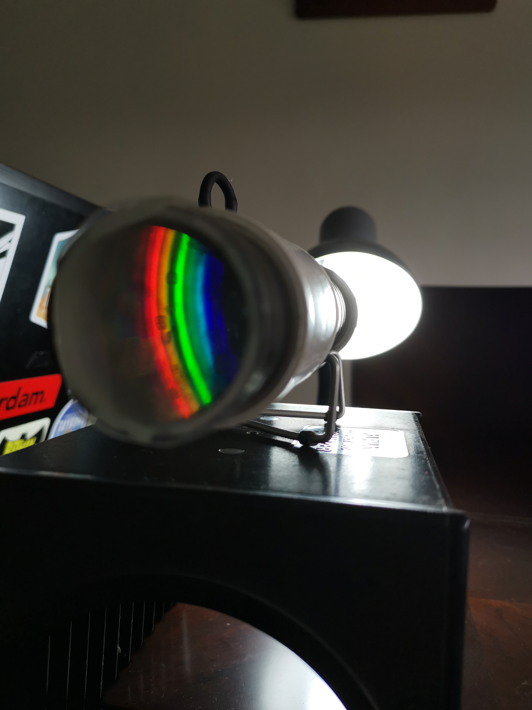 | 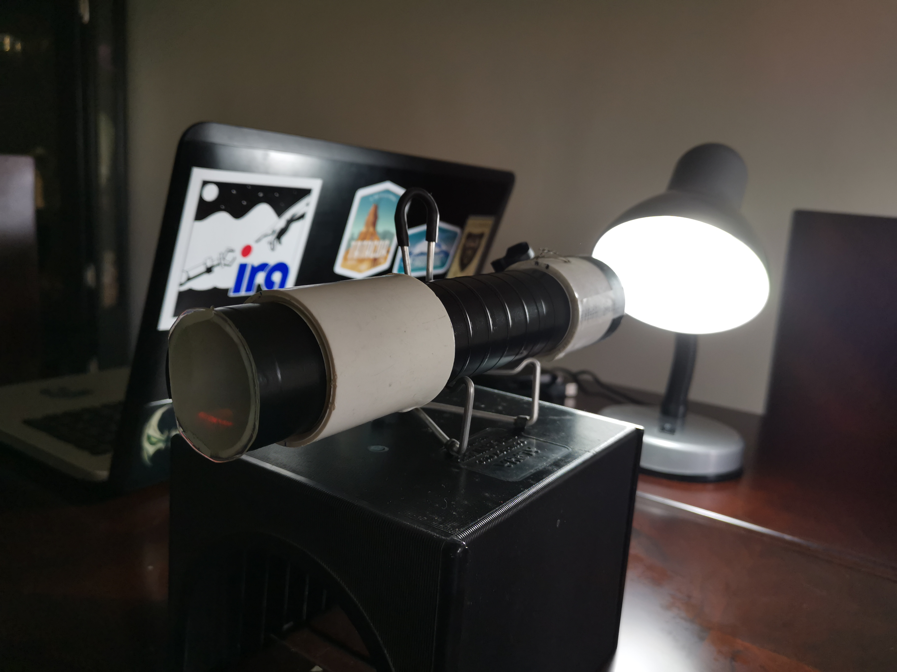 |

Los **materiales** necesarios son:
	
	- Tubo PVC 12 cm y diámetro 5cm
	- Tubo PVC 18 cm y diámetro 4cm
	- 2 LEDs (puede ser uno rojo y otro azul)
	- 2 resistencias de 220 $\Omega$
	- 1 portapilas
	- Cartulina negra
	- 1 Lente (lupa) diámete ~5cm
	- 1 CD

##### Módulo de calibración

Consiste en 2 LEDs, 2 resistencias de 220 $\Omega$ y un portapilas. En un tubo PVC de unos 6cm y diámetro 5cm, se generan 4 entradas para pasar los LEDs como se muestra en la figura.

Módulo Calibración  |                           |                    |
:-------------------------:|:-------------------------:|:------------------:|
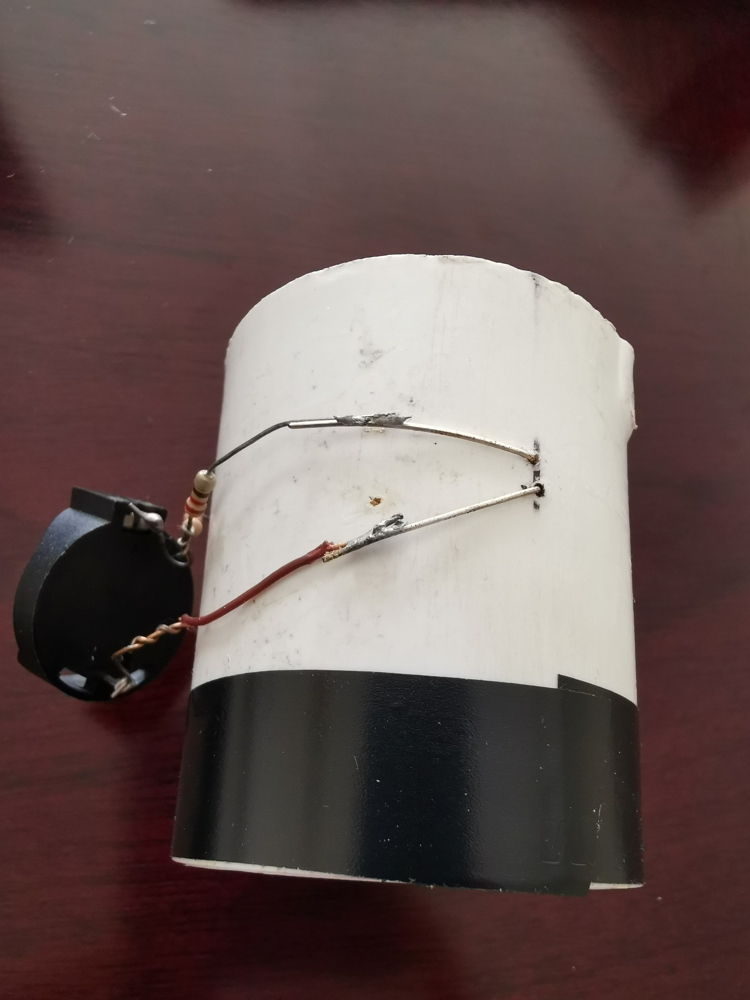 | 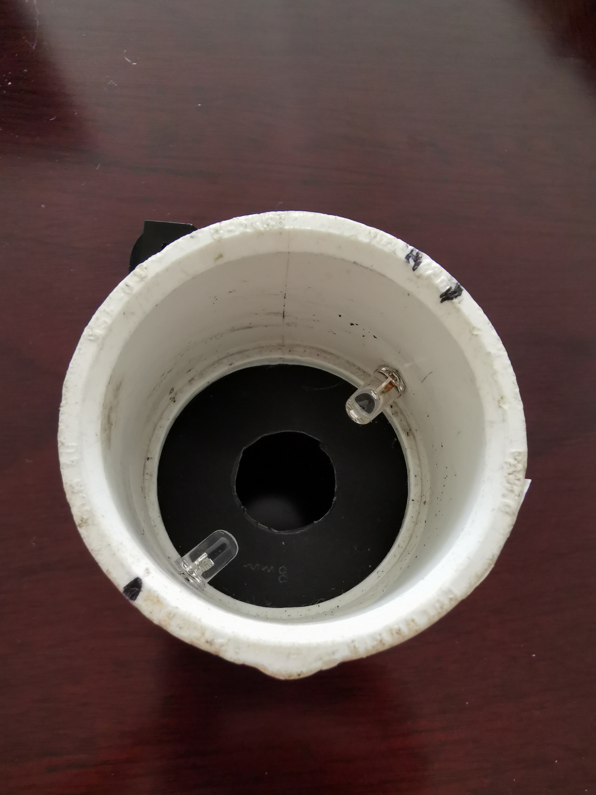 | 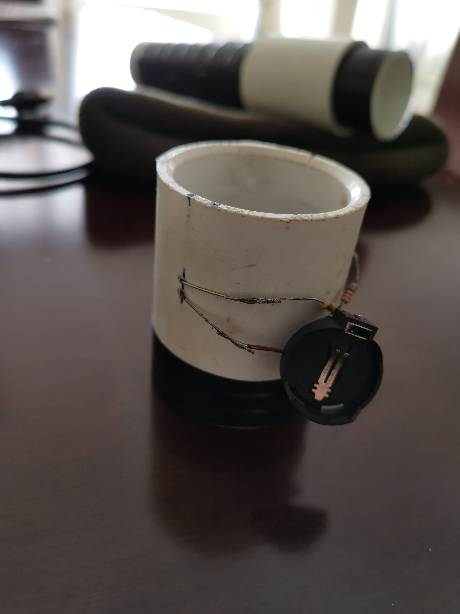 |

##### Módulo de admisión de la Luz

Consiste en un tubo PVS de 14 cm y diámetro 4 cm, adentro del tubo se recubre con una cartulina negra y en sus extremos se coloca una tapa de cartulina negra con una rendija de 1mm.

Módulo admisión de la Luz    |                         |
:-------------------------:|:-------------------------:|
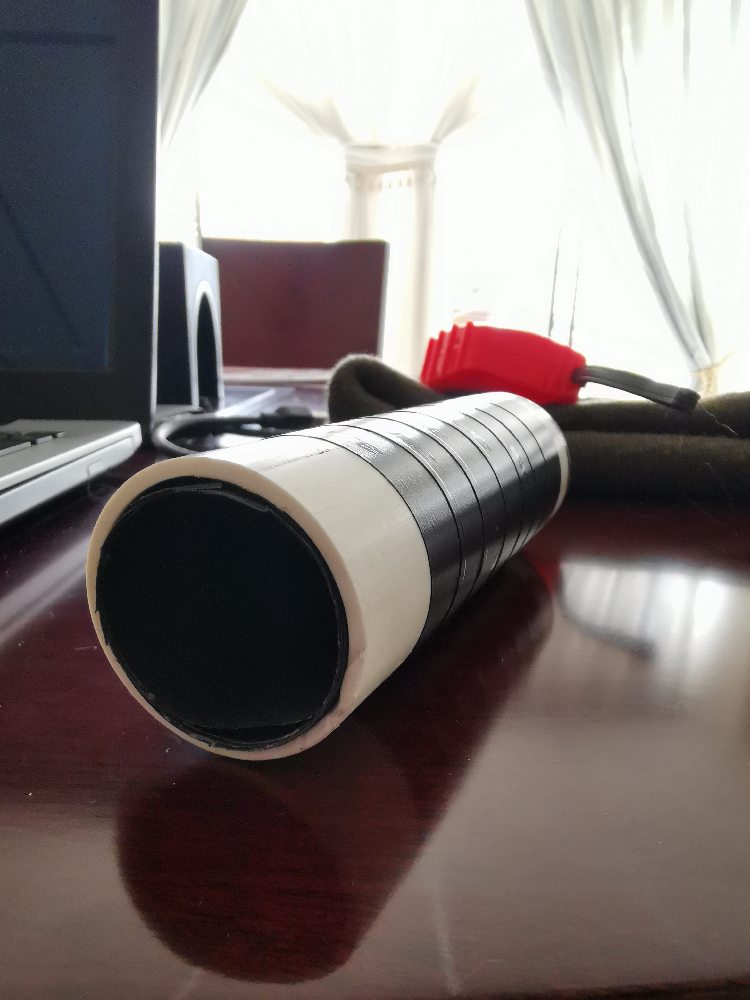 | 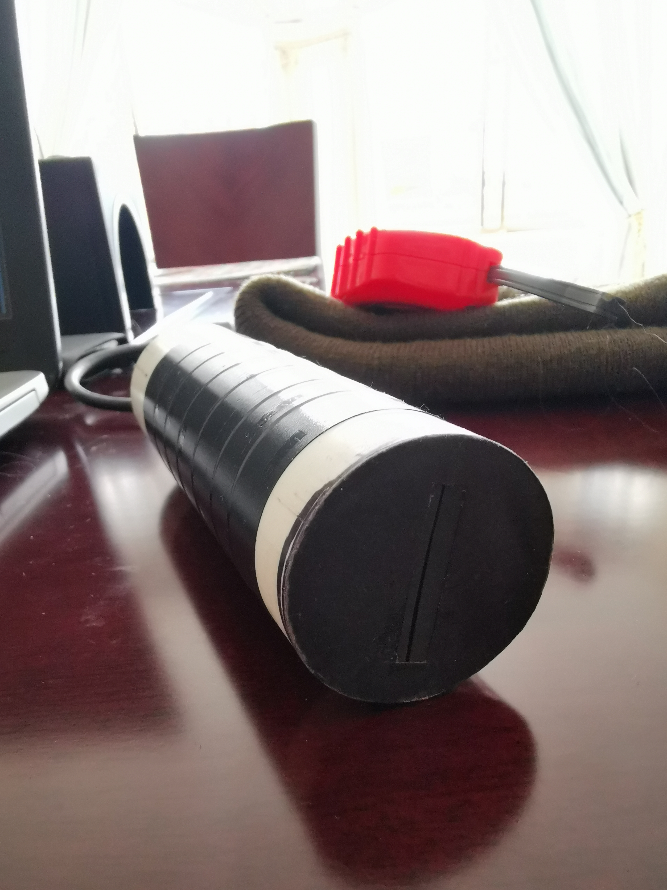 |

##### Módulo de difracción

El lente (de una lupa, por ejemplo) se coloca adentro de un tubo PVC de 6cm y diámetro 5cm. Después, en el tubo de PVC de diámetro 4 cm y largo 4 cm, se recorta un círculo de 4cm del CD y se pega en un extremo.

Módulo admisión difracción: Lente    |                         |
:-------------------------:|:-------------------------:|
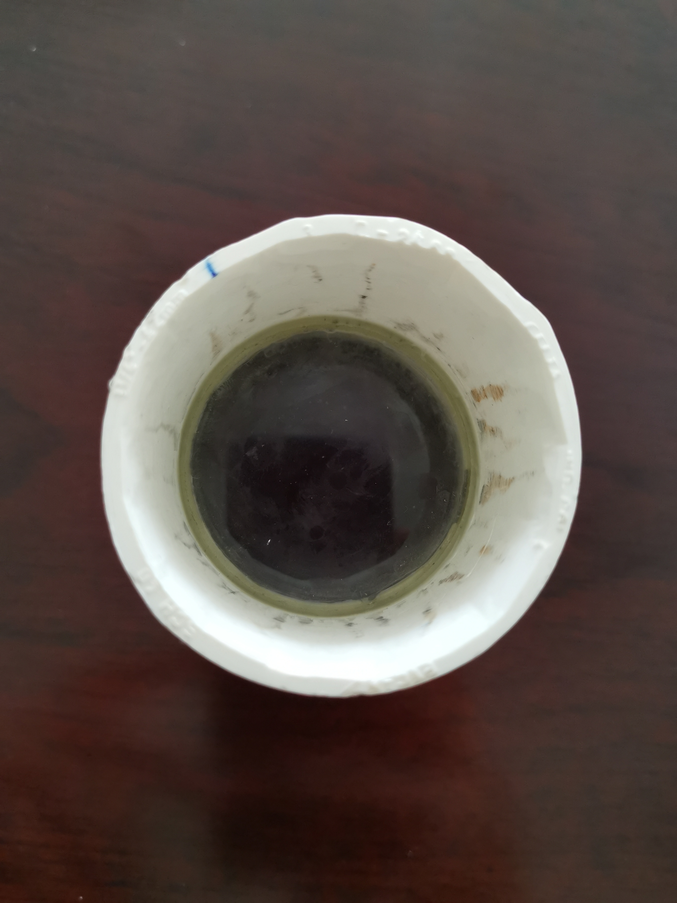 | 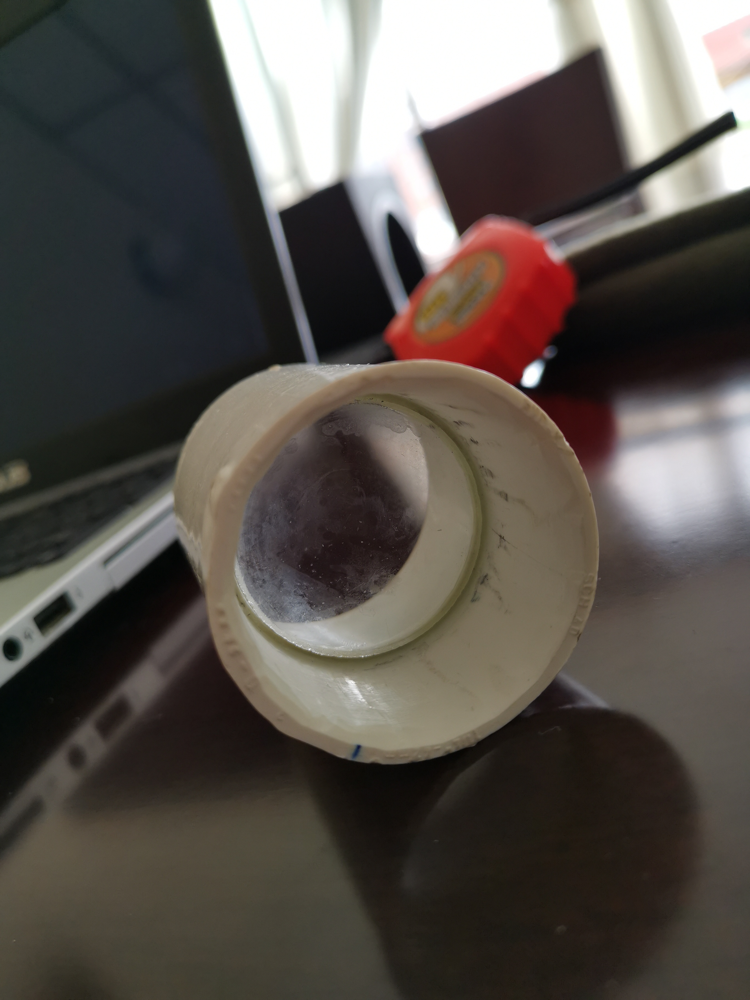 |
Red de Difracción	|			|
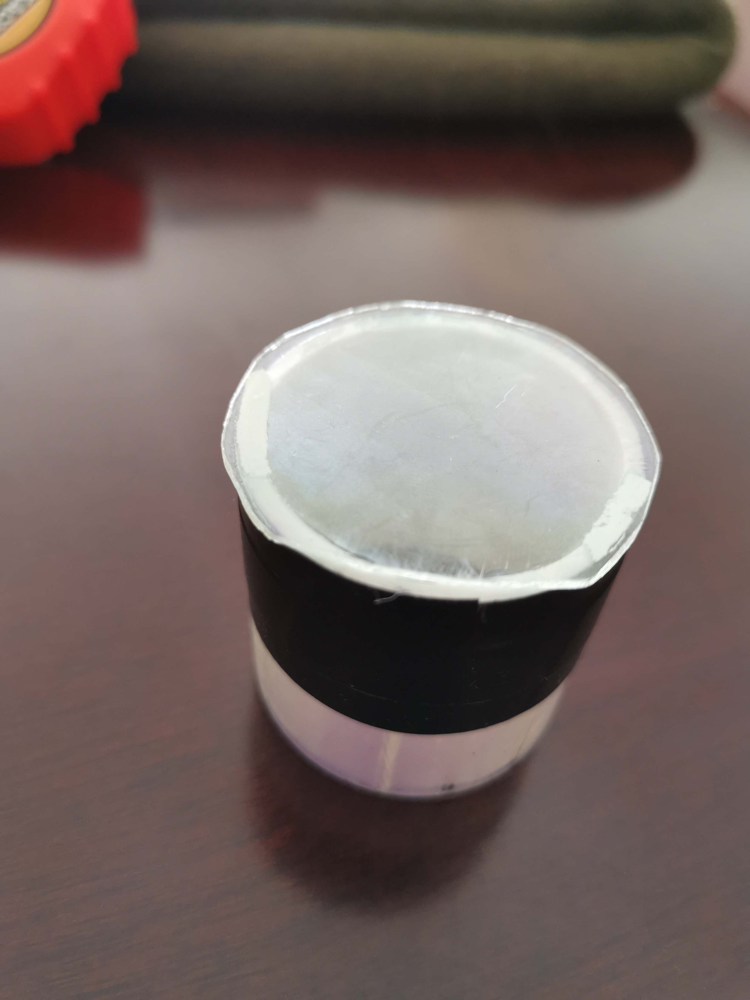 | 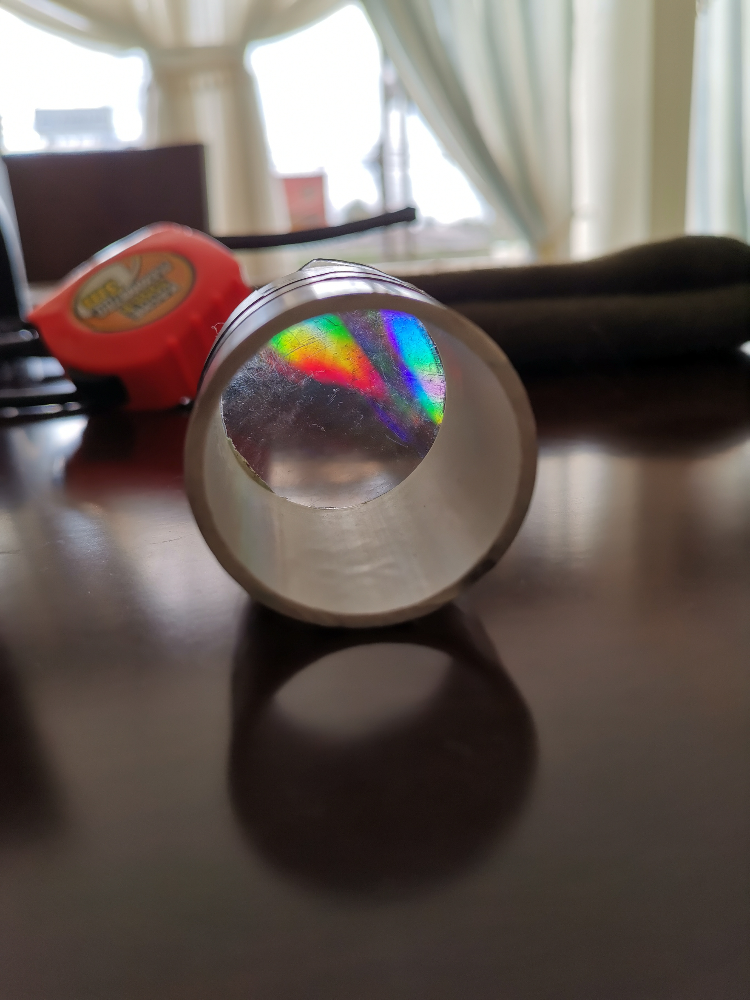 |

