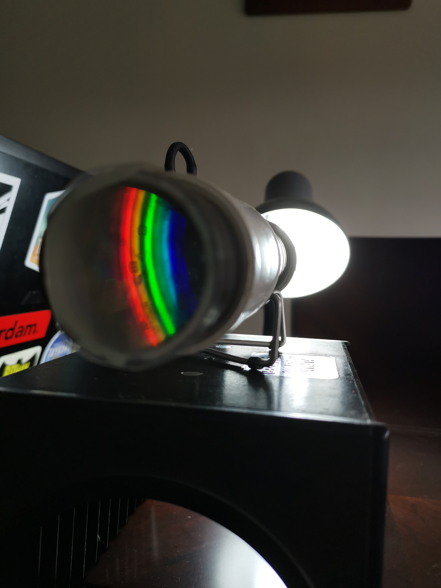
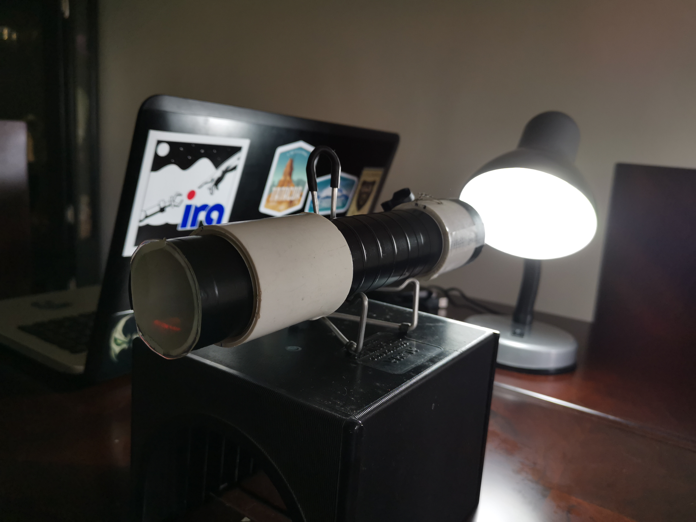

# Espectroscopía: Interacción entre la materia y la radiación electromagnética

La espectroscopía tiene como función básica descomponer la radiación incidente en sus componentes elementales (las diferentes longitudes de onda de la cual está compuesta),  para así analizar el espectro electromagnético y  obtener información sobre la estructura y propiedades de la materia. 
Mediante la construcción de un espectroscopio de bajo costo, podremos entender los conceptos básicos de esta técnica y su aplicación en astronomía e ingeniería.

Setup		|		|
:--------------:|:-------------:|
 | | 
